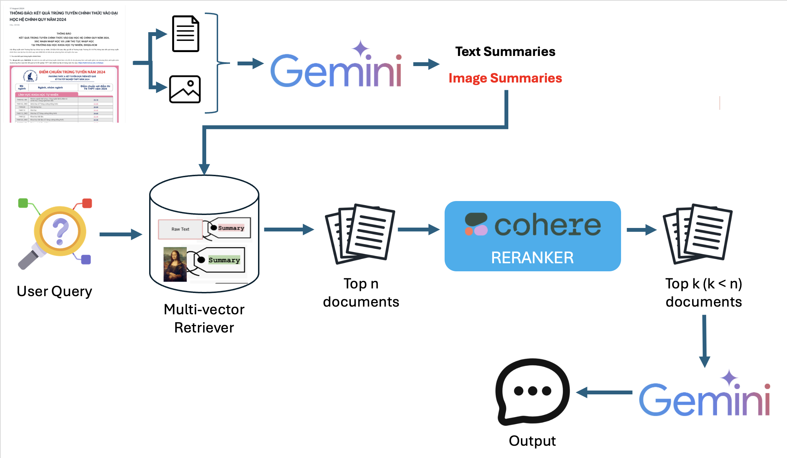

# University Admission Consulting Chatbot

## Introduction

This chatbot is designed to provide comprehensive and personalized guidance to students seeking admission to universities. Leveraging cutting-edge natural language processing and machine learning techniques, it offers a user-friendly and interactive experience, empowering students to make informed decisions about their academic future.

## Table of Content

- [Introduction](#introduction)
- [Project organization](#project-organization)
- [RAG Components](#rag-components)
  - [Gemini Summarizer](#gemini-summarizer)
  - [Multi-vector Retriever](#multi-vector-retriever)
  - [Query Processing and Document Retrieval](#query-processing-and-document-retrieval)
  - [Cohere Reranker](#cohere-reranker)
  - [Gemini for Final Output Generation](#gemini-for-final-output-generation)
- [Installation](#installation)
  - [Prerequisites](#prerequisites)
  - [Installation](#installation)
    - [Setup Python environemt](#setup-python-environemt)
    - [Running API Server](#running-api-server)
    - [Running WebUI](#running-webui)

## Project organization

```
.
├── airflow_dags/
│   └── update_retriever_dag.py
├── assets/
├── azure_data_etl/
│   ├── .vscode
│   |   ├── extensions.json
│   |   ├── launch.json
│   |   ├── settings.json
│   |   └── tasks.json
│   ├── data
│   |   └── sitemap.json
│   ├── modules
│   |   └── scraper
│   |       ├── __init__.py
│   |       ├── scrape.py
│   |       ├── table_extractor.py
│   |       └── utils.py
│   ├── agent_chunking.py
│   ├── gemini_config.py
│   ├── image_extractor.py
│   ├── prompts.py
│   ├── utils.py
│   └── vectorstore.py
├── backend
│   ├── app
│   |   ├── __init__.py
│   |   └── server.py
│   ├── Dockerfile
│   ├── pyproject.toml
│   └── README.md
├── data
│   ├── documents.json
│   ├── sitemap.json
│   ├──summaries.json
│   └──tmp_data.json
├── frontend 
├── notebooks
│   ├── 1_data_scraping.ipynb
│   ├── 2_image_extractor.ipynb
│   ├── 3_ingest_data.ipynb
│   ├── 4_multimodal_rag.ipynb
│   ├── 5_main.ipynb
│   ├── 6_generate_data.ipynb
│   └── 7_evaluate
├── script
│   ├── start.sh
│   └── transform_env.sh
├── src
│   ├── __init__.py
│   ├── agent_chunking.py
│   ├── document_prepare.py
│   ├── embedding.py
│   ├── gemini_config.py
│   ├── image_extractor.py
│   ├── indexing.py
│   ├── main.py
│   ├── prompts.py
│   ├── rag_chain.py
│   ├── utils.py
│   └── vectorstore.py
├── .dockerignore
├── .env
├── .gitignore
├── .gitmodules
├── Dockerfile
├── LICENSE
├── README.md
└── requirements.txt
```

## RAG Components

Our RAG (Retrieval-Augmented Generation) pipeline efficiently processes text and image inputs, retrieves relevant information, and generates accurate responses to user queries. The pipeline leverages Gemini's advanced language and vision capabilities, combined with sophisticated retrieval and reranking mechanisms.

The entire RAG pipeline can be illustrated as following image:



### Gemini Summarizer

- Processes both textual documents and images
- Generates concise summaries for each input type
- Enables efficient storage and retrieval of information

### Multi-vector Retriever

- Utilizes a hybrid storage approach:
  - MongoDB as the document store for raw data and metadata
  - Pinecone as the vector store for embedding-based retrieval
- Stores summaries of text and images generated by Gemini
- Enables efficient retrieval based on user queries using semantic search

### Query Processing and Document Retrieval

- When a user sends a query:
  1. The retriever first returns the top n documents with the highest cosine similarity scores
  2. These initial results are then passed to the reranking step for further refinement

### Cohere Reranker

- Refines the initial set of retrieved documents
- Uses advanced language understanding to improve relevance ranking
- Produces a smaller, more focused set of top-k documents (where k < n)
- Ensures the most pertinent information is prioritized for the final response generation

### Gemini for Final Output Generation

- Takes the reranked top-k documents as input
- Leverages Gemini's advanced language understanding and generation capabilities
- Generates the final response or output based on the most relevant information
- Ensures contextually appropriate and accurate answers to user queries

This pipeline combines cutting-edge language and vision models with efficient retrieval and reranking techniques to provide accurate, context-aware responses across a wide range of user queries and input types.

## Installation

This section will guide users on setting up and running your University Admission Consulting Chatbot locally.1.

### Prerequisites:

- Python 3.12.4
- pip (Python package installer)
- Jupyter Notebook (if users will be interacting with notebooks).

### Installation:

**1. Setup Python environemt**

```bash
python -m venv .venv
pip install -r requirements.txt
```

**2. Running API Server**

We will using `LangServe` to run an LLM API quickly and easily

```bash
cd backend
langchain serve
```

**3. Running WebUI**

Open new terminal and run following command

```bash
cd frontend
npm run dev
```

The you can access `localhost:3000` to talk with **Admission Consultant Chatbot**

## Future Works

- Update the WebUI Interface to make application more user-friendly
- Evaluate RAG system (We are not doing this in the present because of LLM resource limitation to generate a test set)


