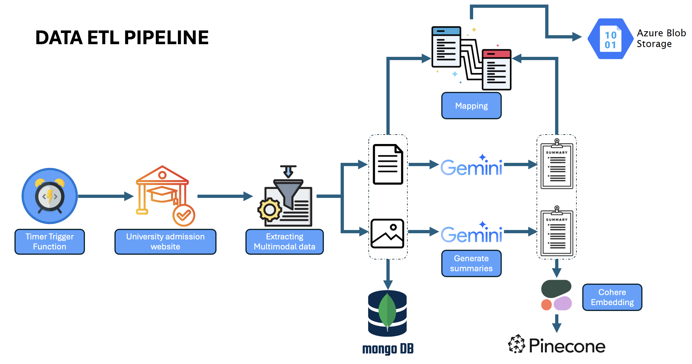

# University Admission Data ETL Pipeline

## Table of Contents
1. [Project Overview](#project-overview)
2. [Data ETL Pipeline](#data-etl-pipeline)
3. [Installation](#installation)
4. [Usage](#usage)
5. [Configuration](#configuration)
6. [Contributing](#contributing)
7. [License](#license)

## Project Overview

This project implements a sophisticated ETL (Extract, Transform, Load) pipeline for processing and analyzing university admission data. It leverages various technologies to automate data collection, processing, and storage, while incorporating AI-powered summarization and vector search capabilities.

## Data ETL Pipeline

Our data ETL pipeline efficiently processes university admission data through several stages. Here's a visual representation of the pipeline:

### Pipeline Components

1. **Timer Trigger Function**: Initiates the ETL process at scheduled intervals.
2. **University Admission Website**: The source of our raw data.
3. **Extracting Multimodal Data**: Pulls various types of data (text, images, etc.) from the source.
4. **MongoDB**: Stores the raw extracted data.
5. **Mapping**: Map the original data to corresponding summaries
6. **Gemini AI**: Generates summaries from the processed data.
7. **Azure Blob Storage**: Stores the mapping file.
8. **Cohere Embedding**: Creates vector embeddings of the data.
9. **Pinecone**: Vector database for efficient similarity search and retrieval.

### Pipeline Flow

1. The Timer Trigger Function activates the pipeline at predetermined intervals.
2. Data is extracted from the University Admission Website.
3. The Extracting Multimodal Data component pulls various data types.
4. Raw data is stored in MongoDB for preservation and potential reprocessing.
5. The Mapping component standardizes the data format.
6. Processed data is sent to Gemini AI for summary generation.
7. Both the processed data and generated summaries are stored in Azure Blob Storage.
8. Cohere Embedding creates vector representations of the data.
9. The embeddings are stored in Pinecone for efficient querying and analysis.

### Key Features

- **Multimodal Data Handling**: Capable of processing various data types (text, images, etc.).
- **AI-Powered Summarization**: Utilizes Gemini AI for generating insights from the data.
- **Scalable Storage**: Leverages both MongoDB and Azure Blob Storage for different data storage needs.
- **Vector Search Capabilities**: Incorporates Cohere Embedding and Pinecone for advanced data querying and analysis.

### Benefits

- Automated data collection and processing
- Efficient handling of diverse data types
- AI-driven insights generation
- Scalable and flexible data storage solutions
- Advanced search and analysis capabilities

Adjust the values according to your specific setup and requirements.